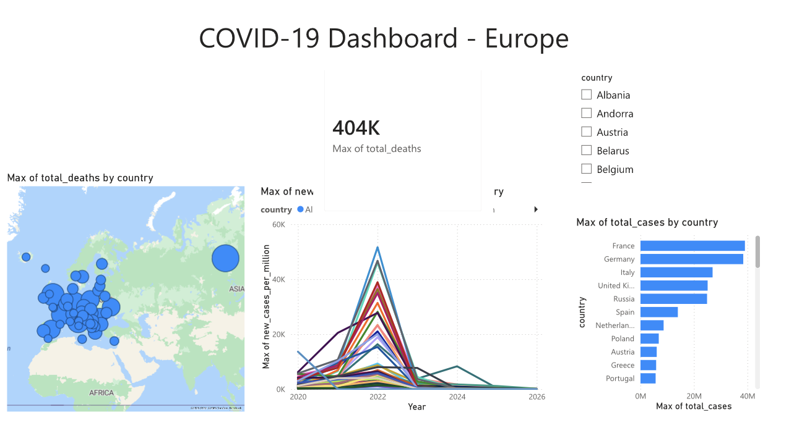

# COVID-19 Power BI Dashboard

An interactive Power BI dashboard exploring the global trajectory of COVID-19 across 12 countries (2020–2024), built as a companion piece to my [Baltimore Food Security Dashboard](#) (R Shiny). Where the Shiny project demonstrates dashboarding in R, this one demonstrates the same analytical instincts in Power BI.

## Dashboard



## What it shows

- **Cumulative cases & deaths over time** — line charts tracking the pandemic's waves across countries
- **Case burden per million** — normalising by population for fair cross-country comparison
- **Geographic view** — total cases mapped by country
- **Interactive filtering** — slicers for country and date range

## Data

Source: [Our World in Data — COVID-19 dataset](https://github.com/owid/covid-19-data) (CC BY 4.0).

The raw OWID dataset is ~94 MB. I trimmed it to a portfolio-friendly extract (`covid_data.csv`, ~60 KB):
- 12 representative countries across all continents
- Monthly snapshots (last reported day of each month)
- Key indicators: cases, deaths, per-capita rates, and vaccination coverage

The trimming logic is reproducible — see the note below.

## Files

| File | Description |
|------|-------------|
| `covid_dashboard.pbix` | The Power BI report |
| `covid_data.csv` | Cleaned dataset feeding the report |
| `dashboard.png` | Static preview of the dashboard |

## How to open

1. Install [Power BI Desktop](https://powerbi.microsoft.com/desktop/) (free, Windows).
2. Open `covid_dashboard.pbix`.
3. If prompted, point the data source at `covid_data.csv` in this folder.

## Reproducing the data extract

```python
import pandas as pd

cols = ['iso_code','continent','location','date','total_cases','new_cases',
        'total_deaths','new_deaths','total_cases_per_million',
        'total_deaths_per_million','people_fully_vaccinated',
        'people_fully_vaccinated_per_hundred','population']
df = pd.read_csv('owid-covid-data.csv', usecols=cols, low_memory=False)

countries = ['United States','United Kingdom','Germany','India','Brazil',
             'France','Italy','South Africa','Japan','China','Canada','Australia']
df = df[df['location'].isin(countries)].copy()
df['date'] = pd.to_datetime(df['date'])
df['ym'] = df['date'].dt.to_period('M')
monthly = df.sort_values('date').groupby(['location','ym']).tail(1).drop(columns=['ym'])
monthly.to_csv('covid_data.csv', index=False, date_format='%Y-%m-%d')
```

## License

Data © Our World in Data, licensed under CC BY 4.0. Dashboard and code in this repo are MIT licensed.
